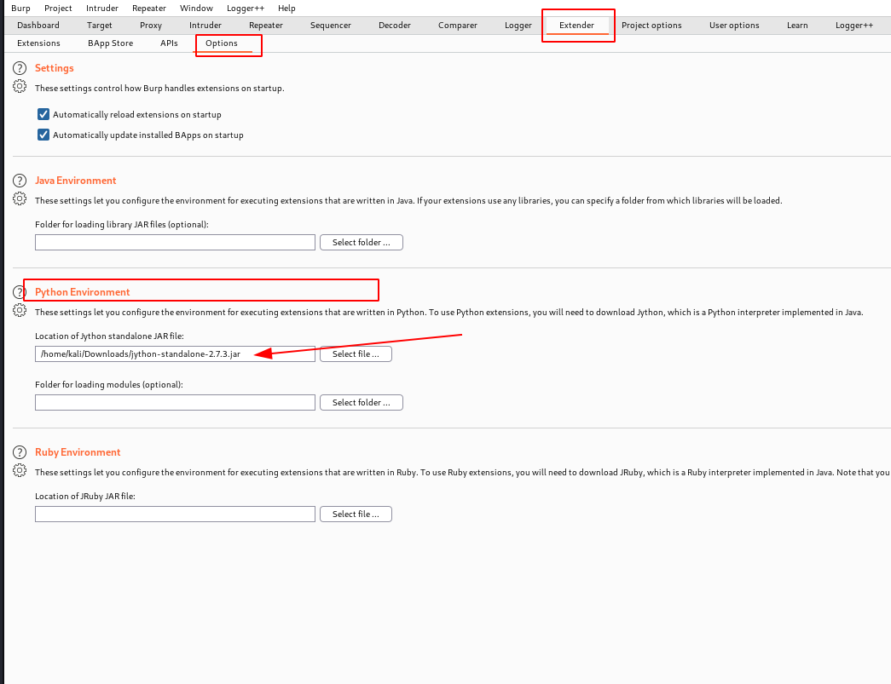
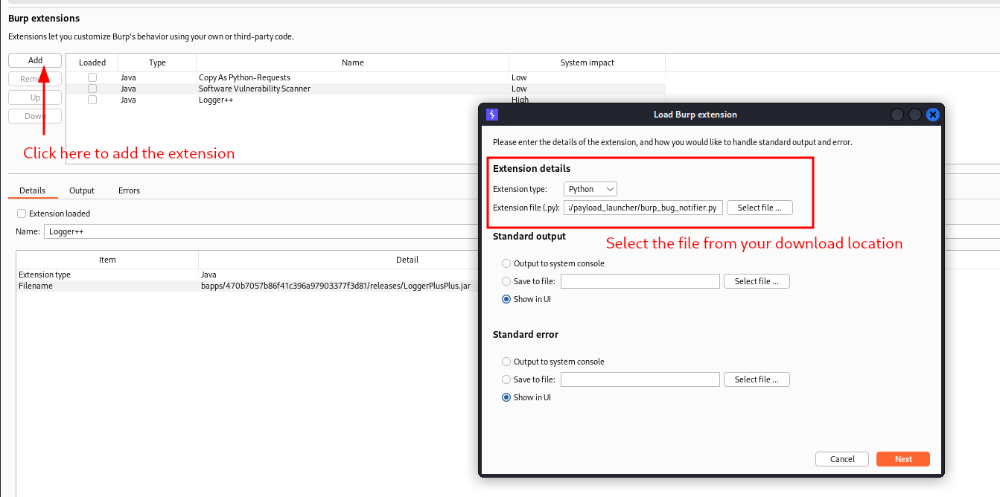
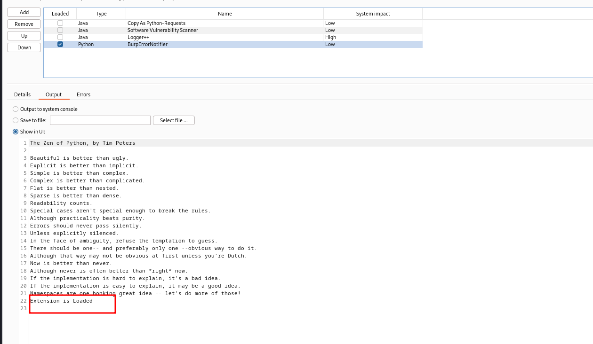
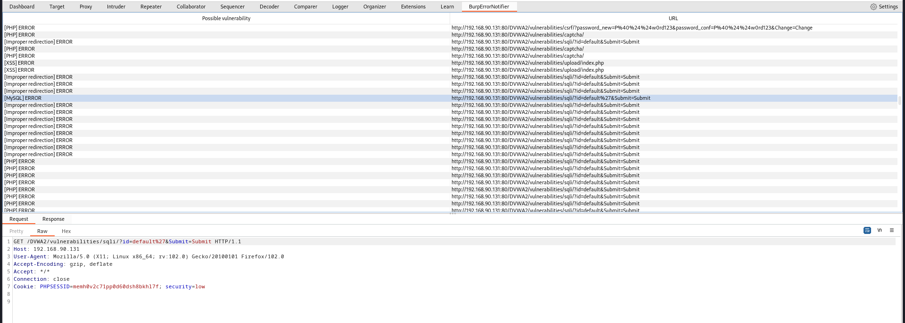
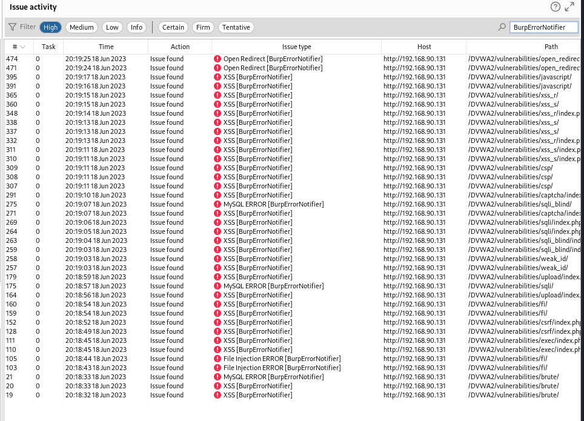
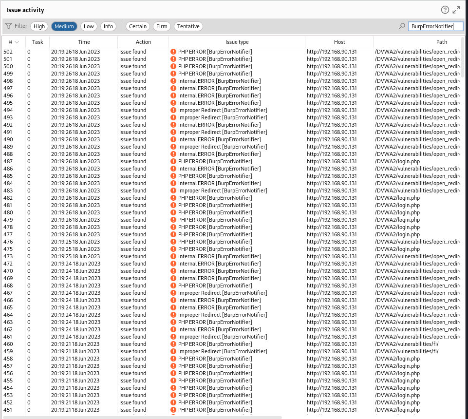

# payload_launcher

In 2022, I released [burp_bug_finder](https://github.com/lucsemassa/burp_bug_finder), a custom BurpSuite plugin (written in python) that simplifies the discovery of some web vulnerabilities. After installing, the process involved including the tested url in the scope, browsing the website and filling out forms manually. During testing, I realized I could potentially miss some vulnerabilities certain pages or by not accessing certain pages or by overlooking hidden forms in the user view.

The current project aims to automate the entire process. The tool browses through every link and sends payloads in every encountered form. It consists of two modules:
- **the payload launcher**: to automate the payload sending process
- **burp_bug_notifier**: the BurpSuite plugin designed to detect vulnerabilities.

The required inputs for the testing process are as follows:
- the link to be tested
- your cookies (in case you want to perform an authenticated pentest)
- the excluded link such as logout page

Here are the features covered by the tool :
- [x] Bypass CSRF protection
- [x] Fill automatically forms with payload (file input in not yet implemented)
- [x] Fill password, email, url, date, time, number, checkbox, tel, submit, text, hidden, textarea, trix-editor fields
- [x] Detect XSS vulnerability
- [x] Detect Error based SQLi vulnerability
- [x] Detect Local File Injection vulnerability (LFI)
- [x] Detect Open Reddirect vulnerability
- [x] Detect improper redirection
- [x] Detect improper error handling such as exception, database error, warning message  
- [x] Scan only given path(s) specified by regex
- [x] Scan all endpoints of the app excluding given path(s) specified by regex
- [x] Create a tab for vulnerabilities
- [x] Add issues found in the dashboard (this feature requires BurpSuite Pro)


## Installation 
1. Install jython and include it in the extender tab. 
The lastest version (2.7.3) at today date can be downloaded here https://repo1.maven.org/maven2/org/python/jython-standalone/2.7.3/jython-standalone-2.7.3.jar

2. Include the jython in the python environment in Extender > Options > Python Environment 


3. Download the burp_bug_notifer.py from this repository and include it the extensions list of BurpSuite. Make sure the plugin is successfully loaded. 
```
git clone https://github.com/lucsemassa/burp_bug_notifier.git
```




4. Download the nedded packages with `pip3 install -r requirements.txt` 

## Usage 
**The first step and mandatory is to add your target in the burpsuite scope.**


### Print the help menu
```
python3 payload_launcher.py -h
```

### Scrap and send payloads to all get and post forms 
```
python3 payload_launcher.py -l http://192.168.90.131/DVWA2/
```

### Scrap and send payloads to all get and post forms in an authenticated way (cookie needed)
The cookie can be copied from BurpSuite. You can use **Copy As Python-Requests** plugin of BurpSuite to copy the cookies in the json format.
```
python3 payload_launcher.py -l http://192.168.90.131/DVWA2/ -c '{"PHPSESSID":"5rqbtmsf1phcc83mkgio8kvjb9", "security": "low"}'
```

### Add custom headers
```
python3 payload_launcher.py -l http://192.168.90.131/DVWA2/ -c '{"PHPSESSID":"5rqbtmsf1phcc83mkgio8kvjb9", "security": "low"}' -H '{"User-Agent": "Mozilla/5.0 (X11; Linux x86_64; rv:102.0) Gecko/20100101 Firefox/102.0", "Accept":"text/html,application/xhtml+xml,application/xml;q=0.9,image/avif,image/webp,*/*;q=0.8", "Accept-Language": "en-US,en;q=0.5", "Accept-Encoding": "gzip, deflate", "Connection": "close", "Upgrade-Insecure-Requests": "1"}' 
```


### Scrap and send payloads to all links excluding one, two or more links 
The excluded links should be added in regex format separated with spaces. For example here, we will be excluding logout.php setup.php and everything available at /vulnerabilities/upload/  
```
python3 payload_launcher.py -l http://192.168.90.131/DVWA2/ -c '{"PHPSESSID":"5rqbtmsf1phcc83mkgio8kvjb9", "security": "low"}' -H '{"User-Agent": "Mozilla/5.0 (X11; Linux x86_64; rv:102.0) Gecko/20100101 Firefox/102.0", "Accept":"text/html,application/xhtml+xml,application/xml;q=0.9,image/avif,image/webp,*/*;q=0.8", "Accept-Language": "en-US,en;q=0.5", "Accept-Encoding": "gzip, deflate", "Connection": "close", "Upgrade-Insecure-Requests": "1"}'  -e logout\.php setup\.php \/vulnerabilities\/upload\/ 
```

### Scrap and send payloads to specific 
The same concept of regex applies here.
As for example, we will scan only /vulnerabilities/sqli/  vulnerabilities/open_redirect/ and vulnerabilities/fi/?page=include.php
```
python3 payload_launcher.py -l http://192.168.90.131/DVWA2/ -c '{"PHPSESSID":"5rqbtmsf1phcc83mkgio8kvjb9", "security": "low"}' -H '{"User-Agent": "Mozilla/5.0 (X11; Linux x86_64; rv:102.0) Gecko/20100101 Firefox/102.0", "Accept":"text/html,application/xhtml+xml,application/xml;q=0.9,image/avif,image/webp,*/*;q=0.8", "Accept-Language": "en-US,en;q=0.5", "Accept-Encoding": "gzip, deflate", "Connection": "close", "Upgrade-Insecure-Requests": "1"}'  -i \/vulnerabilities\/sqli\/ -i \/vulnerabilities\/open_redirect\/ page=include\.php
```

### Scrap and send payloads to all get and post forms of /vulnerabilities/* excepting /vulnerabilities/captcha/ and /vulnerabilities/javascript/

```
python3 payload_launcher.py -l http://192.168.90.131/DVWA2/ -c '{"PHPSESSID":"5rqbtmsf1phcc83mkgio8kvjb9", "security": "low"}' -H '{"User-Agent": "Mozilla/5.0 (X11; Linux x86_64; rv:102.0) Gecko/20100101 Firefox/102.0", "Accept":"text/html,application/xhtml+xml,application/xml;q=0.9,image/avif,image/webp,*/*;q=0.8", "Accept-Language": "en-US,en;q=0.5", "Accept-Encoding": "gzip, deflate", "Connection": "close", "Upgrade-Insecure-Requests": "1"}'  -i \/vulnerabilities\/[a-zA-Z_ -]+\/ -e \/vulnerabilities\/captcha\/ \/vulnerabilities\/javascript\/
```


## Use case
We will be scanning DVWA in **authenticated mode**.
We will need cookie and we will be excluding logout.php (to prevent logging out) and security.php (to keep dvwa security to low for the poc).
These two pages will be added in regex format separated with space.

```
python3 payload_launcher.py -l http://192.168.90.131/DVWA2/ -c '{"PHPSESSID":"memh0v2c71pp0d60dsh8bkhl7f", "security": "low"}' -H '{"User-Agent": "Mozilla/5.0 (X11; Linux x86_64; rv:102.0) Gecko/20100101 Firefox/102.0"}'  -e logout\.php security\.php
```


The result of the scan is given in a tab named BurpErrorNotifier.


For BurpPro user, the vulnerabilities are also presented in the dashboard filtered by severity.


- Dashboard of High severity issues

- Dashboard of Medium severity issues
